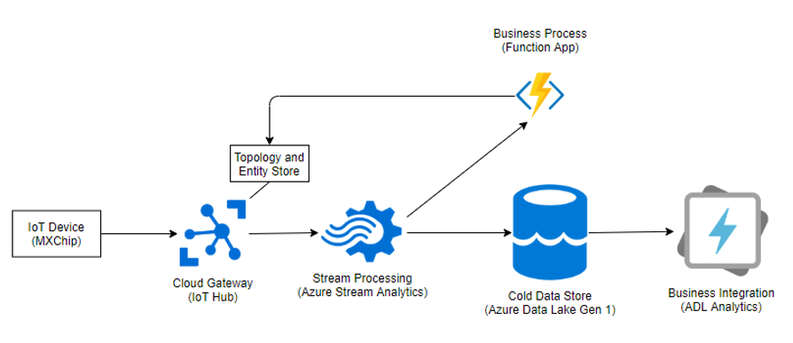
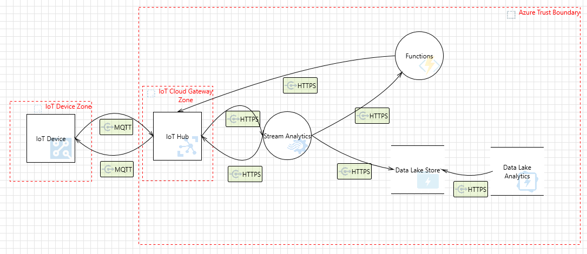
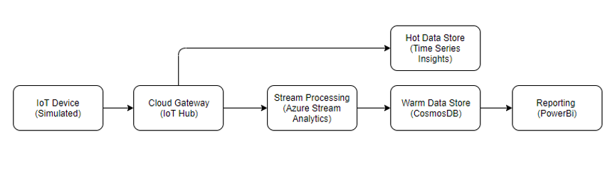
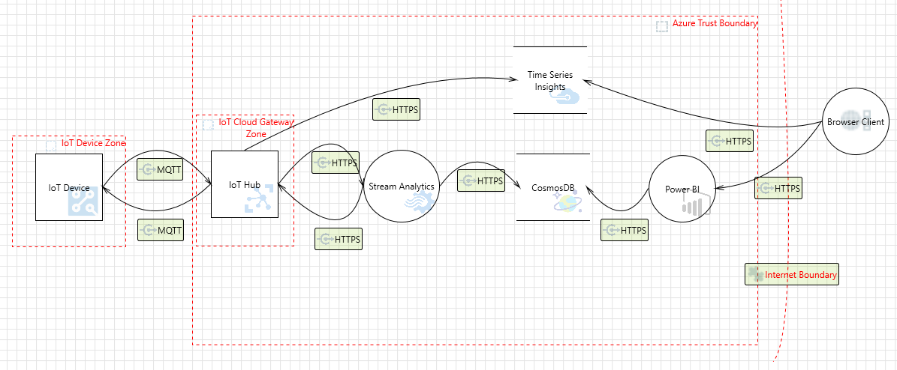
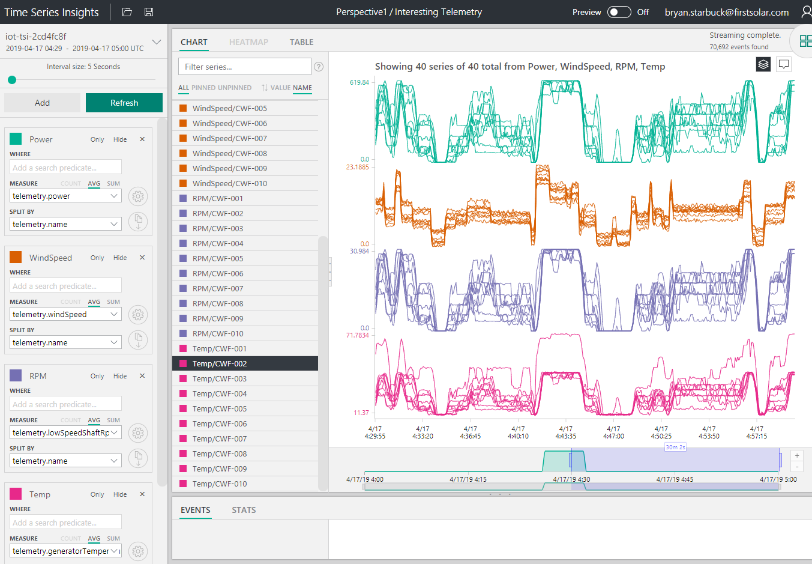
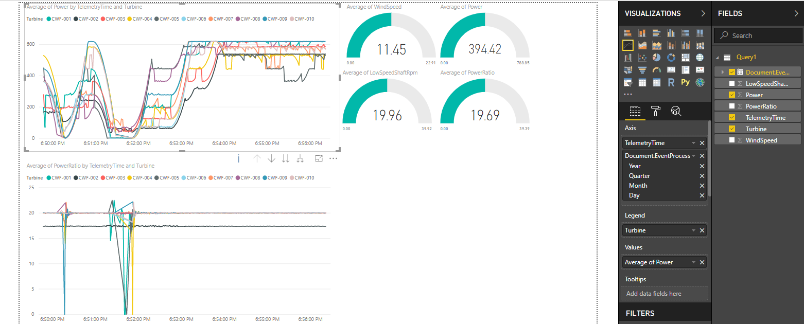

# IoT Capstone

Completed Capstone for the [Microsoft Professional Program IoT Track](https://academy.microsoft.com/en-us/professional-program/tracks/internet-of-things/).

The capstone project consisted of applying the Azure IoT technology to two use cases. First was a weather station collecting wind and temperature data.  An MXChip was used with C++ code written with the Arduino toolset.  The code sends data to an IoT hub for stream processing and storage in a cold data store.  Azure Data Lake Analytics was used to find anomalous data.  An azure function interacted with the device twin to change operating parameters on the device.

The second project was a simulated wind farm.  Ten simulated devices send data to an IoT Hub.  Hot Data path was implemented with Time Series Insights.  A warm data path was implemented with stream analytics and CosmosDB.  A dashboard was created to display NoSQL documents from CosmosDB.  

## Lab1:

Proof of Value Architecture

Threat Model

## Lab2

Threat Model

### Hot Data Dashboard

### Warm Data Dashboard

